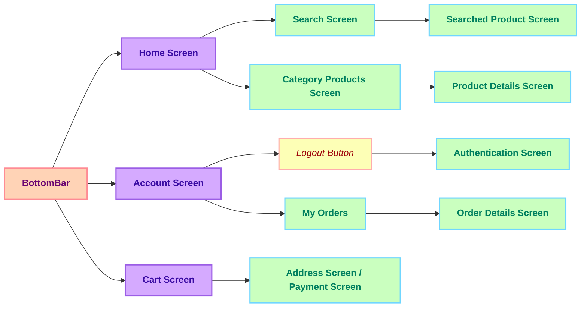
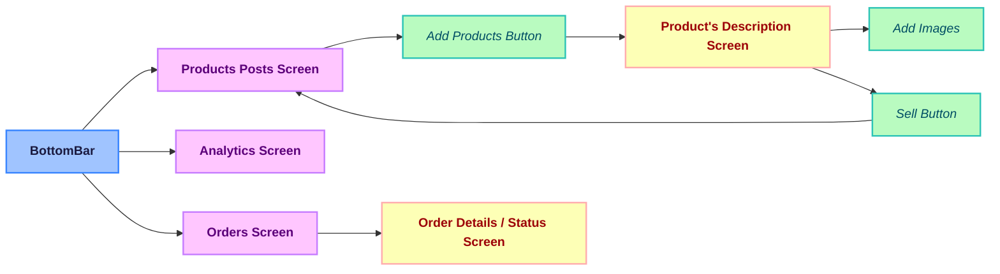

# 🛍️ ShopNest

**ShopNest** is a full-stack E-commerce application built using the **Flutter** framework for the frontend and **Node.js + Express.js** for the backend. It uses **MongoDB** as the database and **Provider** for state management.

This app supports both **Admin** and **User** functionalities, aiming to replicate the core features of an online retail platform.

---

## ⚙️ Tech Stack

- **Frontend:** Flutter
- **State Management:** Provider
- **Backend:** Node.js, Express.js
- **Database:** MongoDB
- **Authentication:** JSON Web Tokens (JWT)
- **Payment:** Mock Payment via Flutter Pay

---

## 🎯 Key Features

### 🔐 Authentication
- JWT-based authentication system.
- Persistent login state using tokens.

### 🛠️ Admin Capabilities
- Add new products with image and category.
- View category-wise sales in pie chart format.
- Manage all customer orders and update their status in real-time.

### 🧑 User Features
- View personalized "Deal of the Day".
- Browse products by category.
- Search for products and view detailed info.
- Rate products with real-time updates.
- Add items to cart and manage quantity in real-time.
- Save delivery address and place orders.
- Rate products with real-time updates.
- View past orders and their statuses.

### 💳 Payment System
- Mock payment integrated using **Flutter Pay**.
- Secure order placement after address validation.

### ⭐ Product Rating
- Users can rate products.
- Real-time average rating displayed for each product.

### 🛒 Cart Management
- Live cart updates with quantity changes.
- Cart state synced across screens via Provider.

### 📦 Order & Order Status
- Users can place multiple orders.
- Admin can update order statuses in real-time.

---
## Getting Started

Follow the steps below to run the project locally:

### 1. Clone the Repository

```bash
git clone <[Shopnest](https://github.com/RageRaghav/ShopNest/)>
cd your-repo-folder
```

### 1. Add Dependencies

```bash
flutter pub get
```

### 3. Run the App

```bash
flutter run
```
---

## 🔁 User Panel Navigation Flow


## 🛠️ Admin Panel Navigation Flow



## 📡 API Overview

### 🔐 Auth APIs

| Route                     | Method | Request                            | Response                    | Description                     |
|---------------------------|--------|------------------------------------|-----------------------------|---------------------------------|
| `/api/signup`            | POST   | `{ name, email, password }`        | `{ user object }`           | Create new user                |
| `/api/signin`            | POST   | `{ email, password }`              | `{ token, user object }`    | Login and receive JWT token    |
| `/tokenIsValid`          | POST   | `x-auth-token` in headers          | `true / false`              | Validate token                 |
| `/`                      | GET    | `x-auth-token` in headers          | `{ user object + token }`   | Get current logged-in user     |

---

### 🧑‍💼 Admin APIs

| Route                             | Method | Request                             | Response                     | Description                         |
|----------------------------------|--------|-------------------------------------|------------------------------|-------------------------------------|
| `/admin/add-product`            | POST   | `{ name, description, images, quantity, price, category }` | `{ saved product }`  | Add a new product                   |
| `/admin/get-products`           | GET    | void                                | `[ all products ]`           | Get all products                    |
| `/admin/delete-products`        | POST   | `{ id }`                            | `{ deleted product }`        | Delete product by ID               |
| `/admin/get-orders`             | GET    | void                                | `[ all orders ]`             | Get all orders                     |
| `/admin/change-order-status`    | POST   | `{ id, status }`                    | `{ updated order }`          | Update order status                |
| `/admin/analytics`              | GET    | void                                | `{ earnings by category }`   | Get earnings breakdown             |

---

### 👤 User APIs

| Route                          | Method  | Request                                | Response               | Description                        |
|--------------------------------|---------|----------------------------------------|------------------------|------------------------------------|
| `/api/add-to-cart`           | POST    | `{ id (productId) }`                   | `{ updated user }`     | Add product to cart               |
| `/api/remove-from-cart/:id`  | DELETE  | `:id` param                            | `{ updated user }`     | Remove product from cart          |
| `/api/save-user-address`     | POST    | `{ address }`                          | `{ updated user }`     | Save delivery address             |
| `/api/order`                 | POST    | `{ cart, address, totalPrice }`        | `{ placed order }`     | Place a new order                 |
| `/api/orders/me`             | GET     | void                                   | `[ user's orders ]`     | Get current user's orders         |

---

### 📦 Product APIs

| Route                                 | Method | Request                          | Response                   | Description                         |
|--------------------------------------|--------|----------------------------------|----------------------------|-------------------------------------|
| `/api/products?category=xyz`        | GET    | Query param: `category`          | `[ filtered products ]`    | Get products by category            |
| `/api/products/search/:name`        | GET    | Param: `:name`                   | `[ search results ]`       | Search products by name             |
| `/api/rate-product`                 | POST   | `{ id, rating }`                 | `{ updated product }`      | Rate a product                      |
| `/api/deal-of-day`                  | GET    | void                             | `{ top-rated product }`    | Get deal of the day                 |

---

## 📌 Note

This project demonstrates a scalable, production-level full-stack E-commerce architecture. Both user and admin functionalities are clearly separated and well-integrated.

### 🧩 RESTful API Integration

- The backend exposes clean and modular **RESTful APIs** using **Express.js**.
- Each route follows a structured and secure approach with **JWT-based authentication**.
- API responses are handled gracefully in the Flutter frontend using **async service layers**.
- Real-time updates (e.g., cart, ratings, order status) are managed efficiently with **Provider**.
- The admin dashboard interacts with APIs for product management, order updates, and analytics via dynamic HTTP requests.

> All major actions in the app — from authentication to placing orders and updating order statuses — are performed through well-structured and reusable API endpoints.

---

> Built by Raghav Jindal
